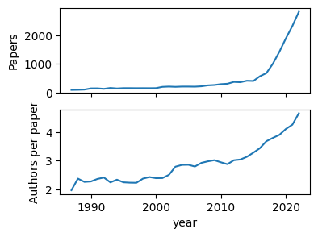

# neurips.json

NeurIPS paper metadata in a json file (and the code to recreate and update that
file).

```python
>>> import json
>>> with open('neurips.json') as infile:
...     papers = json.loads(infile.read())
>>> papers[5165]  # word2vec
{'abstract': 'The recently introduced continuous Skip-gram model is an efficient method for learning high-quality distributed vector representations that capture a large number of precise syntactic and semantic word relationships.  In this paper we present several improvements that make the Skip-gram model more expressive and enable it to learn higher quality vectors more rapidly.  We show that by subsampling frequent words we obtain significant speedup,  and also learn higher quality representations as measured by our tasks. We also introduce Negative Sampling, a simplified variant of Noise Contrastive Estimation (NCE) that learns more accurate vectors for frequent words compared to the hierarchical softmax.   An inherent limitation of word representations is their indifference to word order and their inability to represent idiomatic phrases.  For example, the meanings of Canada\'\' and "Air\'\' cannot be easily combined to obtain "Air Canada\'\'.  Motivated by this example, we present a simple and efficient method for finding phrases, and show that their vector representations can be accurately learned by the Skip-gram model. "',
 'authors': ['Tomas Mikolov',
  'Ilya Sutskever',
  'Kai Chen',
  'Greg S. Corrado',
  'Jeff Dean'],
 'title': 'Distributed Representations of Words and Phrases and their Compositionality',
 'year': 2013}
```

## pandas example

Load the data into a pandas DataFrame and find the number of papers by year:

```python
>>> import pandas as pd
>>> papers = pd.read_json('neurips.json')
>>> npapers = papers.groupby('year').size()
>>> print(npapers)
year
1987      90
1988      94
1989     101
[...]
2017     679
2018    1009
2019    1428
dtype: int64
```

Find the average number of authors by year:

```python
>>> nauthors = papers['authors'].apply(len).groupby(papers['year']).mean()
>>> print(nauthors)
year
1987    1.966667
1988    2.372340
1989    2.257426
[...]
2017    3.671576
2018    3.789891
2019    3.899160
Name: authors, dtype: float64
```

Plot these:

```python
>>> import matplotlib.pyplot as plt
>>> import seaborn
>>> fig, ax = plt.subplots(2, 1, sharex=True, figsize=(4, 3))
>>> ax[0] = npapers.plot(ax=ax[0])
>>> ax[0].set_ylabel('Papers')
>>> ax[0].set_ylim(0, None)
>>> ax[1] = nauthors.plot(ax=ax[1])
>>> ax[1].set_ylabel('Authors per paper')
>>> fig.savefig('plot.png', bbox_inches='tight')
```



## Recreate the json from scratch

`pip install requests beautifulsoup4` then

```python
>>> import json
>>> import neurips
>>> papers = neurips.get_all_years()  # 30-60m on a fast connection
>>> with open('neurips.json', 'w') as fp:
...     json.dump(papers, fp)
```

## Append a year to existing json

```python
>>> papers = neuripsjson.load_and_append_year(2018)
Loaded 8250 papers from neurips.json
Added 1428 papers from 2019
>>> with open('neurips.json', 'w') as fp:
...     json.dump(papers, fp)
```
